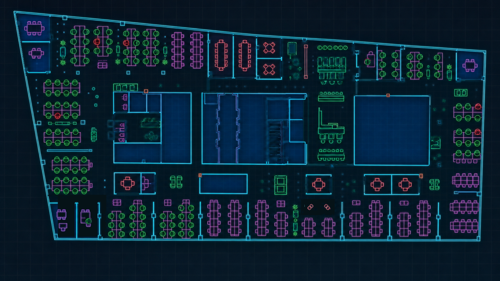

# BankMan

> A neon corporate-IT arcade game about resolving tickets, protecting the SLA, and surviving one more “quick call.”

[Play the live demo](https://bankman.kielak.com) · [Report an issue](https://github.com/kielak1/bankman-portfolio/issues)



BankMan reimagines maze-chase gameplay as a stressful shift in enterprise IT. The player moves through a cyber-styled office, collects 16 tickets, manages a rising stress level, and avoids four enemies with distinct movement and contact effects.

This repository is a sanitized portfolio edition. It contains the complete application code and a presentation-safe game map, but excludes private source materials, internal documentation, credentials, and third-party audio with unclear redistribution rights.

## What this project demonstrates

- Modular gameplay systems in TypeScript rather than one monolithic scene.
- Phaser scene management, collision handling, camera control, and responsive canvas rendering.
- Distinct enemy behaviours backed by a generated navigation graph.
- Desktop and touch input through a shared control layer.
- Serverless API design with validation, deduplication, rate limiting, and environment isolation.
- Graceful degradation from a Redis-backed global leaderboard to local storage.
- A reproducible Node.js toolchain, production build, and least-privilege CI workflow.

## Gameplay

### Objective

Collect all 16 tickets before stress reaches 100. Tickets award base points plus an SLA time bonus. Stress reduces the score, while completing the board ends the shift with `SPRINT COMPLETE`.

### Threats

| Threat | Behaviour |
| --- | --- |
| `MGR` — Manager | Persistently follows the player and increases stress during contact. |
| `BIZ` — Business | The fastest threat; contact causes a large immediate stress spike. |
| `AUD` — Audit | Patrols unpredictably and leaves temporary stress zones. |
| `SEC` — Security | Chases the player, increases stress, and briefly locks movement. |

### Power-ups and events

- **Coffee** reduces stress, awards points, and boosts movement speed.
- **Admin Mode** sends contacted enemies back to their spawn.
- **Pracujemy nad tym** pauses the SLA and slows enemies.
- **Friday Deployment** doubles ticket points while making threats more dangerous.
- Functional rooms provide safe breaks, coffee refills, meeting traps, and random executive decisions.

### Controls

| Input | Action |
| --- | --- |
| `WASD` or arrow keys | Move |
| On-screen joystick | Move on touch devices |
| `M` | Toggle generated sound effects |
| `F1` | Toggle the debug overlay |
| `R` | Restart after a completed shift |

## Architecture

```text
Browser
├── Phaser scenes ........ game lifecycle and rendering
├── Gameplay systems ..... enemies, collision, tickets, stress, rooms, audio
├── UI shell .............. menu, mission brief, HUD, results, touch controls
└── Local storage ......... nickname and offline leaderboard fallback

Vercel Functions
├── GET  /api/leaderboard
└── POST /api/scores ...... validation, deduplication, rate limiting

Upstash Redis
└── isolated development, preview, and production leaderboards
```

The client remains playable when the leaderboard API is unavailable. Completed scores fall back to local storage and are cleared when the global service becomes available again.

## Technology

| Layer | Technology |
| --- | --- |
| Language | TypeScript |
| Game engine | Phaser 4 |
| Build tooling | Vite 8 |
| Backend | Vercel Functions |
| Data | Upstash Redis |
| Deployment | Vercel |
| Continuous integration | GitHub Actions |

## Run locally

### Requirements

- Node.js 24 LTS (see `.nvmrc`)
- npm

Install dependencies and start the frontend:

```bash
npm ci
npm run dev
```

Vite serves the game at `http://127.0.0.1:5173/` by default.

To run the frontend together with the serverless leaderboard API:

```bash
npx vercel dev
```

Vercel manages the Upstash connection. Local credentials belong in `.env.local`, which is ignored by Git. The API expects `KV_REST_API_URL` and `KV_REST_API_TOKEN`; never expose them to client-side code or commit them.

### Available commands

| Command | Purpose |
| --- | --- |
| `npm run dev` | Start the Vite development server. |
| `npm run build` | Type-check and create a production build. |
| `npm run preview` | Preview the production build locally. |
| `npm run leaderboard:clear -- <environment> --confirm` | Clear an explicitly selected leaderboard. |

## API behaviour

`GET /api/leaderboard` returns the current environment and up to ten ranked entries.

`POST /api/scores` accepts a completed score only after validating the UUID, nickname, points, duration, ticket count, outcome, and timestamp. Redis keys provide duplicate protection and a short per-IP submission limit. Each Vercel environment uses separate keys.

## Project structure

```text
api/                    Vercel leaderboard functions
scripts/                guarded administration utilities
src/game/               Phaser entities, scenes, map, and gameplay systems
src/ui/                 application shell, HUD, overlays, and touch controls
src/assets/maps/        presentation-safe runtime map
public/                 public web assets
```

## Quality and security

- CI runs `npm ci` and the production build for pushes and pull requests.
- GitHub Actions receives read-only repository contents permission.
- Dependency updates are monitored by Dependabot.
- Secrets, Vercel metadata, local environment files, source references, and private documentation are excluded.
- The public portfolio edition uses procedural Web Audio effects and does not redistribute the original Mission Brief soundtrack.

Known limitations:

- The JavaScript bundle and map image still need size optimisation.
- The navigation graph can require tuning around narrow passages.
- Score validation prevents malformed submissions but is not authoritative anti-cheat because gameplay runs in the browser.
- Automated gameplay tests and linting are planned; the current CI verifies type-checking and production bundling.

## Author

Created by [Tadeusz Kielak](https://github.com/kielak1).

## Usage rights

This repository is publicly visible for portfolio review and evaluation. It is not open source. Copyright © 2026 Tadeusz Kielak. All rights reserved. See [LICENSE](LICENSE) for details.
